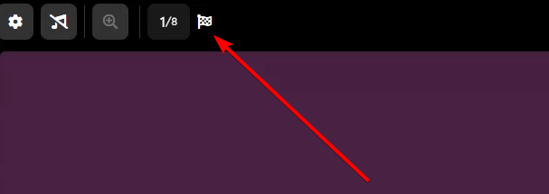

# Quizizz Assistant

Quizizz Assistant is a userscript designed to assist with Quizizz games by marking the correct answers. It uses the [CheatNetwork](https://cheatnetwork.eu/) API to retrieve the answers for a given Quizizz game.

## Features
Note: This has only been tested in Test Mode (Free Version) with MCQ and MSQ.

- Automatically marks the correct answers in Quizizz games.
- Uses the CheatNetwork API to retrieve answers.
- Works seamlessly with the Quizizz interface.

## Installation

This script is designed to be used with a userscript manager such as Tampermonkey.

1. Install Tampermonkey from the [Chrome Web Store](https://chrome.google.com/webstore/detail/tampermonkey/dhdgffkkebhmkfjojejmpbldmpobfkfo) or [Firefox Add-ons](https://addons.mozilla.org/en-US/firefox/addon/tampermonkey/).
2. Click on the `Raw` button at the top of the script view on GitHub.
3. Tampermonkey should recognize the script and ask for permission to install it.
4. Click `Install` to add the script to Tampermonkey.

## Usage

Note: Before you do anything, make sure to login to [CheatNetwork](https://cheatnetwork.eu/login) as the script will use your cookies in order to access the API.

1. Navigate to a Quizizz game.
2. The script will automatically run and add a button to retrieve answers.
[] NOTE: Sometimes you have to refresh the page in order for the script to load!
4. Click the button to retrieve and display the correct answers.

## Debugging

If the button does not show up, refresh the page. Other issues (with button appearing), should be logged in the console, so feel free to send them over in the issues!

## Contributing

Contributions are welcome! If you have a bug to report, a feature to suggest, or changes to contribute, please open an issue to discuss what you would like to change. Pull requests are also welcome.

## License

This project is licensed under the GPL v3 License - see the [LICENSE](LICENSE) file for details.

## Disclaimer

This script is for educational purposes only. Cheating is not encouraged or endorsed. Please use responsibly.

Show support to [CheatNetwork](https://cheatnetwork.eu) and their [Discord](https://discord.com/invite/5N9Km7Udum) server as their services run based on ads and memberships!
